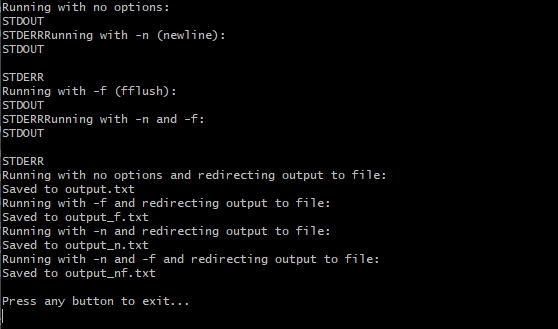

# Вывод и буферизация TTY и PTY

## 1.1. IO_Flush: эксперимент

Под своей обычной десктопной ОС попробуйте:

- Откомпилировать и собрать программу, запустить, как есть.
- Добвить символы `'\n'` в конец строк.
- Убрать `fflush`
- Перенаправить вывод (оба потока) в файл.

Сделайте это в разных сочетаниях. И опишите результат отчёте к данному заданию,
не забыв указать, что у вас за операционная система.

## 1.2. IO_Flush: автоматизация

Сделайте для своей программы параметры, которые позволят включать или выключать опции 
из предыдущего задания. В любом виде, на ваш вкус. И сделайте скрипт 
(сценарий командной оболочки), который бы собирал вашу программу, и запускал бы её 
с разными параметрами, воспроизводя эксперимент из предыдущей задачи.

## Отчёт

Исполняемый код для `1.1. IO_Flush: эксперимент` и `1.2. IO_Flush: автоматизация` 
лежит в [1.1.Experiment](1.1.Experiment) и [1.2.Automation](1.2.Automation) 
директориях соответственно.

Эксперимент проводился на ОС Windows 11, version 24H2, 
по средствам запуска скрипта [run.sh](1.2.Automation/run.sh). 

Ниже приведён его результат выполнения, 
а так же содержимое полученных в результате работы файлов:
<figure>
  
  <figcaption>
    Рис. 1 --- Результат выполнения run.sh
  </figcaption>
</figure>

<figure>
  
  <figcaption>
    Рис. 1 --- Содержимое файлов 
    output.txt, output_n.txt, output_f.txt, output_nf.txt
  </figcaption>
</figure>
