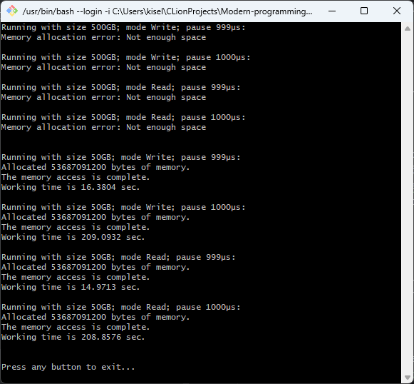
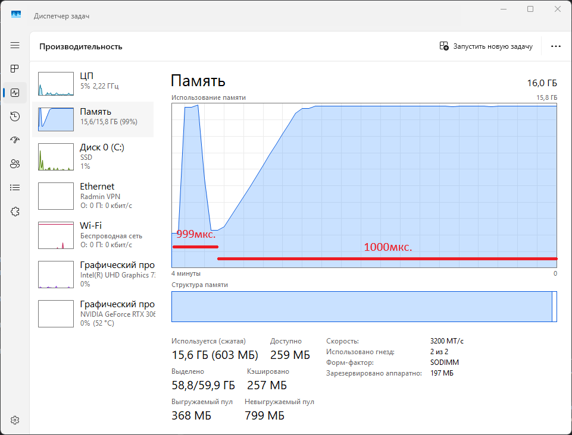

# Оверкоммит

## Испытание

1. Выделить заведомо сликом большое количество памяти при помощи malloc 
   (предпочтительно) или объявления глобального массива. Количество памяти 
   задать параметром командной строки.
2. С шагом в `4 КиБ` (вероятно минимальный размер страницы на вашем компьютере) 
   обращаться к этой памяти на чтение или на запись. Для того, чтобы задать, 
   идёт обращение на чтение или на запись, использовать параметр командной строки.
3. Чтобы процесс был управляемым, раз в неколько тысяч (или десятков, или 
   сотен тысяч, решите сами) обращений делайте паузу на несколько десятков или
   сотен (тоже решите сами) миллисекунд. Чтобы ОС превращалась в тыкву управлямо.
4. Пронаблюдайте за потреблением памяти при помощи системных инструментов. 
   В каких случаях оно будет расти, в каких — нет.
5. Если у вас есть возможность, попробуйте испытать программу под разными ОС.

## Отчёт

Исполняемый код для `Испытание` лежит в [Test](Test) директории.

Эксперимент проводился на ОС Windows 11, version 24H2, 
по средствам запуска скрипта [run.sh](1.2.Automation/run.sh). 

Ниже приведён его результат выполнения:
<figure>
  
  <figcaption>
    Рис. 1 --- Результат выполнения run.sh
  </figcaption>
</figure>

Можно увидеть, что в Windows присутствует ограничение на выделяемую память, 
если заранее известно, что свободной RAM + ROM памяти не хватит, 
то такое количество памяти не аллоцируется. При этом, если всё же свободного места 
будет достаточно, то память будет заполняться лишь по ходу чтения/записи (см. Рис. 2).
<figure>
  
  <figcaption>
    Рис. 2 --- Визуализация занятой памяти от времени двух сценариев программы: 
    50Гб, запись, 999мкс.; 50Гб, запись, 1000мкс.
  </figcaption>
</figure>

Стоит отметить существенную разницу в скорости заполнения памяти, 
при выставлении паузы в `999мкс.` и в `1000мкс.`, а так же, что запись и чтение 
в данном случае выполняются с приблизительно равной скоростью.
